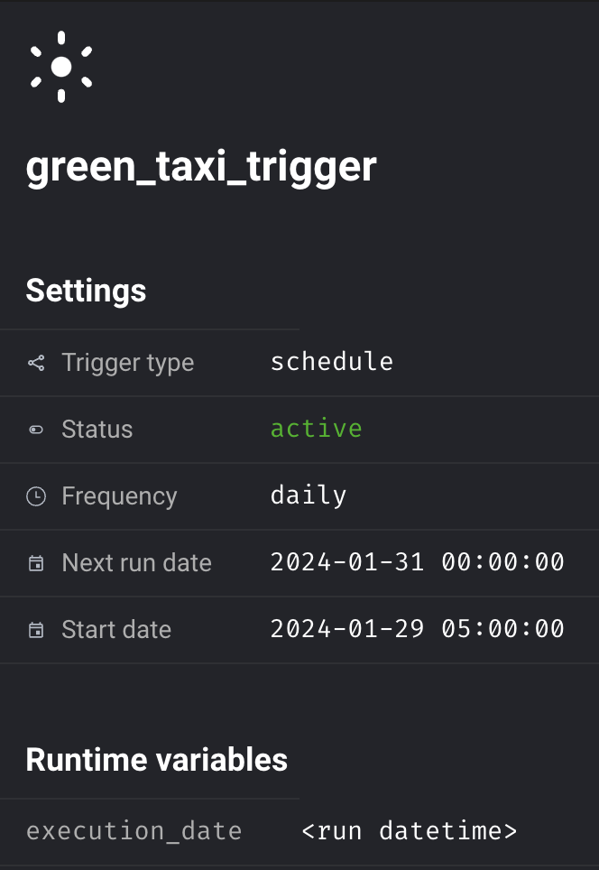

## Week 2 Homework

> In case you don't get one option exactly, select the closest one 

For the homework, we'll be working with the _green_ taxi dataset located here:

`https://github.com/DataTalksClub/nyc-tlc-data/releases/tag/green/download`

### Assignment

The goal will be to construct an ETL pipeline that loads the data, performs some transformations, and writes the data to a database (and Google Cloud!).

- Create a new pipeline, call it `green_taxi_etl`


- Add a data loader block and use Pandas to read data for the final quarter of 2020 (months `10`, `11`, `12`).
  - You can use the same datatypes and date parsing methods shown in the course.
  - `BONUS`: load the final three months using a for loop and `pd.concat`

``` python
import io
import pandas as pd
import requests
if 'data_loader' not in globals():
    from mage_ai.data_preparation.decorators import data_loader
if 'test' not in globals():
    from mage_ai.data_preparation.decorators import test


@data_loader
def load_data_from_api(*args, **kwargs):
    """
    Template for loading data from API
    """
    skeleton_url = 'https://github.com/DataTalksClub/nyc-tlc-data/releases/download/green/green_tripdata_{}.csv.gz'

    months = ['2020-10', '2020-11', '2020-12']

    data = []
    
    # Its always a good practice to define the data types before loading.
    taxi_dtypes = {
        'VendorID' : pd.Int64Dtype(),
        'passenger_count' : pd.Int64Dtype(),
        'trip_distance' : float,
        'RatecodeID' : pd.Int64Dtype(),
        'store_and_fwd_flag' : str,
        'PULocationID' : pd.Int64Dtype(),
        'DOLocationID' : pd.Int64Dtype(),
        'payment_method' : pd.Int64Dtype(),
        'fare_amount': float,
        'extra' : float,
        'mta_tax' : float,
        'tip_amount' : float,
        'tolls_amount' : float,
        'improvement_surcharge' : float,
        'total_amount' : float,
        'congestion_surcharge' : float
    }

    parse_dates = ['lpep_pickup_datetime', 'lpep_dropoff_datetime']

    for month in months:
        url = skeleton_url.format(month)
        print('Downloading file: ', url)
        data.append(pd.read_csv(url, sep=',', compression='gzip', dtype=taxi_dtypes, parse_dates=parse_dates))
    
    return pd.concat(data)


@test
def test_output(output, *args) -> None:
    """
    Template code for testing the output of the block.
    """
    assert output is not None, 'The output is undefined'
```

- Add a transformer block and perform the following:
  - Remove rows where the passenger count is equal to 0 _or_ the trip distance is equal to zero.
  - Create a new column `lpep_pickup_date` by converting `lpep_pickup_datetime` to a date.
  - Rename columns in Camel Case to Snake Case, e.g. `VendorID` to `vendor_id`.
  - Add three assertions:
    - `vendor_id` is one of the existing values in the column (currently)
    - `passenger_count` is greater than 0
    - `trip_distance` is greater than 0

``` python
if 'transformer' not in globals():
    from mage_ai.data_preparation.decorators import transformer
if 'test' not in globals():
    from mage_ai.data_preparation.decorators import test


@transformer
def transform(data, *args, **kwargs):
    
    data = data[data.trip_distance > 0]

    data = data[data.passenger_count > 0]

    data['lpep_pickup_date'] = data['lpep_pickup_datetime'].dt.date

    data.columns = (data.columns
                    .str.replace(r'(?<=[a-z])(?=[A-Z])', '_', regex=True)
                    .str.lower()
    )

    return data


@test
def test_output(output, *args) -> None:
    """
    Template code for testing the output of the block.
    """
    assert output is not None, 'The output is undefined'


@test
def test_output(output, *args) -> None:
    
    assert output['trip_distance'].isin([0]).sum() == 0, 'There are rides with zero passengers'


@test
def test_output(output, *args) -> None:
    
    assert output['passenger_count'].isin([0]).sum() == 0, 'There are rides with zero passengers'


@test
def test_output(output, *args) -> None:
    """
    Template code for testing the output of the block.
    """
    assert 'vendor_id' in output.columns, f'vendor_id is not in {output.columns}'

```

- Using a Postgres data exporter (SQL or Python), write the dataset to a table called `green_taxi` in a schema `mage`. Replace the table if it already exists.

``` python
from mage_ai.settings.repo import get_repo_path
from mage_ai.io.config import ConfigFileLoader
from mage_ai.io.postgres import Postgres
from pandas import DataFrame
from os import path

if 'data_exporter' not in globals():
    from mage_ai.data_preparation.decorators import data_exporter


@data_exporter
def export_data_to_postgres(df: DataFrame, **kwargs) -> None:
    """
    Template for exporting data to a PostgreSQL database.
    Specify your configuration settings in 'io_config.yaml'.

    Docs: https://docs.mage.ai/design/data-loading#postgresql
    """
    schema_name = 'mage'  # Specify the name of the schema to export data to
    table_name = 'green_taxi'  # Specify the name of the table to export data to
    config_path = path.join(get_repo_path(), 'io_config.yaml')
    config_profile = 'dev'

    with Postgres.with_config(ConfigFileLoader(config_path, config_profile)) as loader:
        loader.export(
            df,
            schema_name,
            table_name,
            index=False,  # Specifies whether to include index in exported table
            if_exists='replace',  # Specify resolution policy if table name already exists
        )
```

- Write your data as Parquet files to a bucket in GCP, partioned by `lpep_pickup_date`. Use the `pyarrow` library!

``` python
import pyarrow as pa
import pyarrow.parquet as pq
import os


if 'data_exporter' not in globals():
    from mage_ai.data_preparation.decorators import data_exporter

os.environ['GOOGLE_APPLICATION_CREDENTIALS'] = '/home/src/terraform/.secrets/gcp/my-creds.json'

bucket_name = 'mage-emi-bucket'
project_id = 'terraform-demo-emi'

table_name = 'green_taxi'

root_path = f'{bucket_name}/{table_name}'

@data_exporter
def export_data(data, *args, **kwargs):
    """
    Exports data to some source.

    Args:
        data: The output from the upstream parent block
        args: The output from any additional upstream blocks (if applicable)

    Output (optional):
        Optionally return any object and it'll be logged and
        displayed when inspecting the block run.
    """
    # Specify your data exporting logic here

    table = pa.Table.from_pandas(data)

    gcs = pa.fs.GcsFileSystem()

    pq.write_to_dataset(
        table,
        root_path=root_path,
        partition_cols=['lpep_pickup_date'],
        filesystem=gcs
    )
```

- Schedule your pipeline to run daily at 5AM UTC.



### Questions

## Question 1. Data Loading

Once the dataset is loaded, what's the shape of the data?

* 266,855 rows x 20 columns

## Question 2. Data Transformation

Upon filtering the dataset where the passenger count is greater than 0 _and_ the trip distance is greater than zero, how many rows are left?

* 139,370 rows

## Question 3. Data Transformation

Which of the following creates a new column `lpep_pickup_date` by converting `lpep_pickup_datetime` to a date?

*
```python
data['lpep_pickup_date'] = data['lpep_pickup_datetime'].dt.date
```

## Question 4. Data Transformation

What are the existing values of `VendorID` in the dataset?

* 1 or 2

## Question 5. Data Transformation

How many columns need to be renamed to snake case?

* 4

## Question 6. Data Exporting

Once exported, how many partitions (folders) are present in Google Cloud?

* 96 (In fact got 95)
