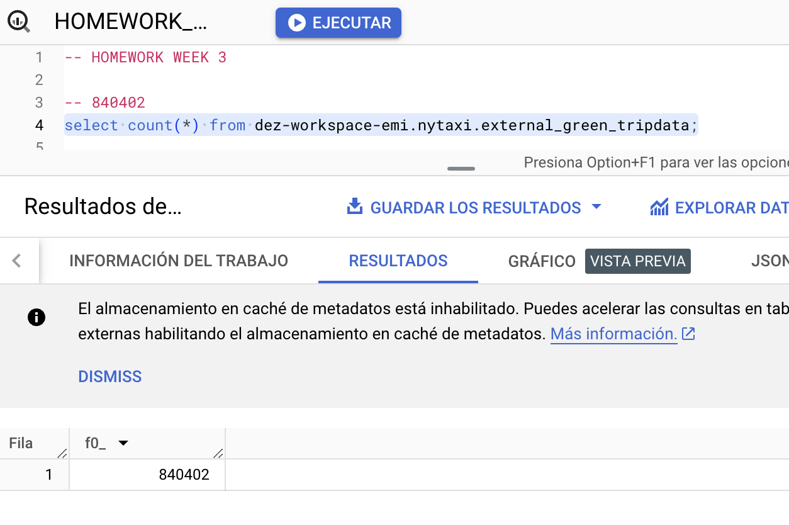
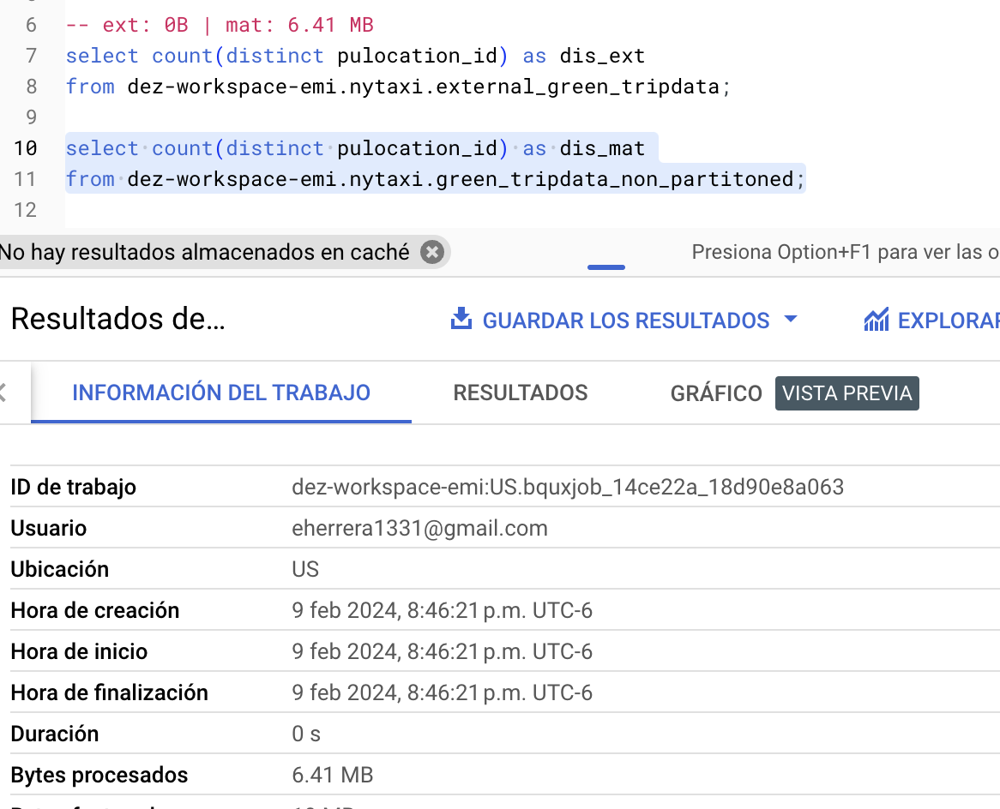
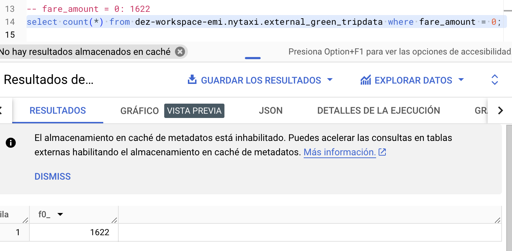
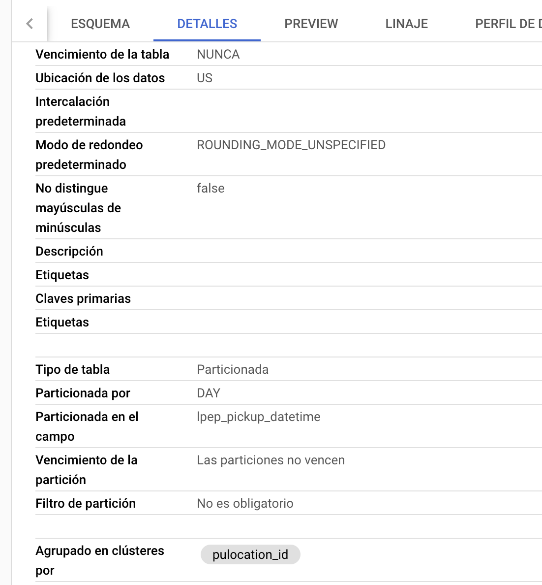
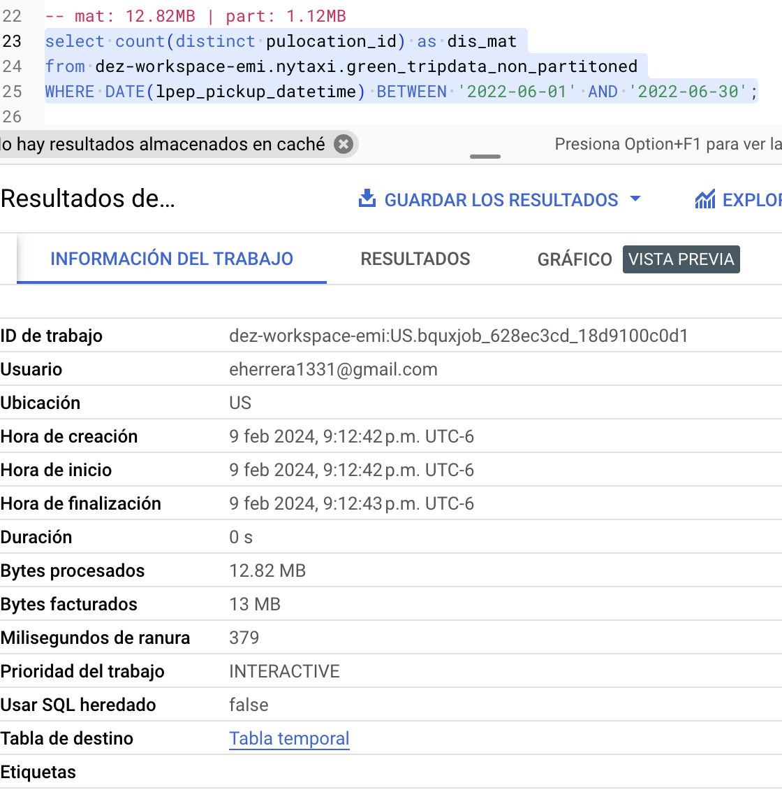
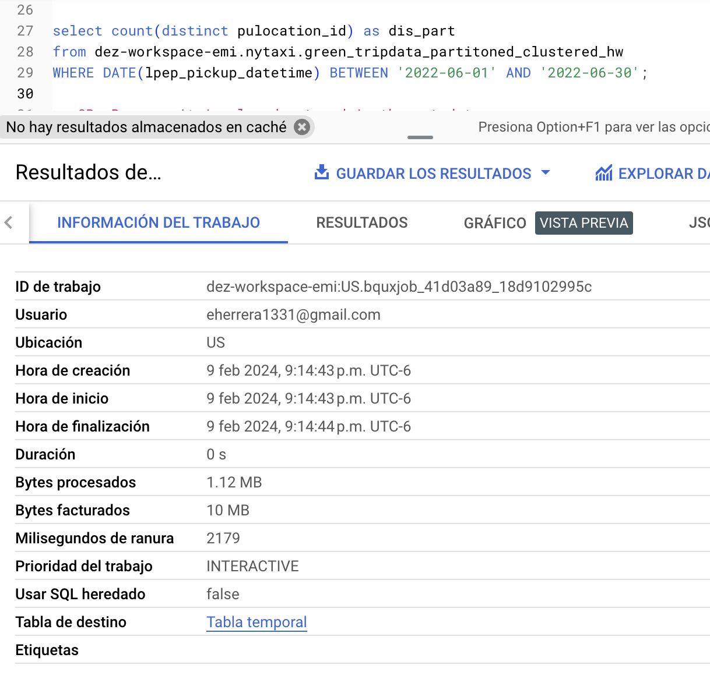

# Data Engineering Zoomcamp 2024 Module 3 Homework  📝

---

### Question 1️⃣
What is count of records for the 2022 Green Taxi Data??

**Answer:**
`840,402`

**Query**
``` sql
SELECT 
    count(*) 
FROM 
    `dez-workspace-emi.nytaxi.external_green_tripdata`;
```

**Output**


---

### Question 2️⃣
Write a query to count the distinct number of PULocationIDs for the entire dataset on both the tables.
What is the estimated amount of data that will be read when this query is executed on the External Table and the Table?

**Answer:**
`0 MB for the External Table and 6.41MB for the Materialized Table`

**Queries** 
``` sql 
-- MATERIALIZED

SELECT 
    count(distinct pulocation_id) as dis_mat 
FROM 
    `dez-workspace-emi.nytaxi.green_tripdata_non_partitoned`;

-- EXTERNAL

SELECT 
    count(distinct pulocation_id) as dis_mat 
FROM 
    `dez-workspace-emi.nytaxi.external_green_tripdata`;
```

**Output**


---

### Question 3️⃣
How many records have a `fare_amount` of `0`?

**Answer:**
`1,622`

``` sql
SELECT 
    count(*) 
FROM 
    `dez-workspace-emi.nytaxi.external_green_tripdata` 
WHERE 
    fare_amount = 0;
```

**Output**



---

### Question 4️⃣
What is the best strategy to make an optimized table in Big Query if your query will always order the results by PUlocationID and filter based on lpep_pickup_datetime? (Create a new table with this strategy)

**Answer:**
`Partition by lpep_pickup_datetime Cluster on PUlocationID`

**Query**
``` sql
CREATE OR REPLACE TABLE 
    `dez-workspace-emi.nytaxi.green_tripdata_partitoned_clustered_hw`
PARTITION BY 
    DATE(lpep_pickup_datetime)
CLUSTER BY 
    pulocation_id AS
SELECT 
    * 
FROM 
    `dez-workspace-emi.nytaxi.external_green_tripdata`;
```

**Output**



---

### Question 5️⃣
Write a query to retrieve the distinct PULocationID between lpep_pickup_datetime 06/01/2022 and 06/30/2022 (inclusive)

Use the materialized table you created earlier in your from clause and note the estimated bytes. Now change the table in the from clause to the partitioned table you created for question 4 and note the estimated bytes processed. What are these values?

Choose the answer which most closely matches.

**Answer:**
`12.82 MB for non-partitioned table and 1.12 MB for the partitioned table`

**Query**
``` sql
SELECT 
    count(distinct pulocation_id) as dis_mat
FROM
    `dez-workspace-emi.nytaxi.green_tripdata_non_partitoned`
WHERE 
    DATE(lpep_pickup_datetime) BETWEEN '2022-06-01' AND '2022-06-30';

SELECT 
    count(distinct pulocation_id) as dis_mat
FROM 
    dez-workspace-emi.nytaxi.green_tripdata_partitoned_clustered_hw
WHERE 
    DATE(lpep_pickup_datetime) BETWEEN '2022-06-01' AND '2022-06-30';
```

**Output**




---

### Question 6️⃣
Where is the data stored in the External Table you created?

**Answer:**
[Your answer here]

---

### Question 7️⃣
It is best practice in Big Query to always cluster your data:

**Answer:**
[Your answer here]

---

### Question 8️⃣
Write a `SELECT count(*)` query FROM the materialized table you created. How many bytes does it estimate will be read? Why?

**Answer:**
[Your answer here]

---


``` sql
-- HOMEWORK WEEK 3

-- 840402
select count(*) from dez-workspace-emi.nytaxi.external_green_tripdata;

-- ext: 0B | mat: 6.41 MB
select count(distinct pulocation_id) as dis_ext
from dez-workspace-emi.nytaxi.external_green_tripdata;

select count(distinct pulocation_id) as dis_mat
from dez-workspace-emi.nytaxi.green_tripdata_non_partitoned;

-- fare_amount = 0: 1622
select count(*) from dez-workspace-emi.nytaxi.external_green_tripdata where fare_amount = 0;

-- 2
CREATE OR REPLACE TABLE dez-workspace-emi.nytaxi.green_tripdata_partitoned_clustered_hw
PARTITION BY DATE(lpep_pickup_datetime)
CLUSTER BY pulocation_id AS
SELECT * FROM dez-workspace-emi.nytaxi.external_green_tripdata;

-- mat: 12.82MB | part: 1.12MB
select count(distinct pulocation_id) as dis_mat
from dez-workspace-emi.nytaxi.green_tripdata_non_partitoned
WHERE DATE(lpep_pickup_datetime) BETWEEN '2022-06-01' AND '2022-06-30';

select count(distinct pulocation_id) as dis_mat
from dez-workspace-emi.nytaxi.green_tripdata_partitoned_clustered_hw
WHERE DATE(lpep_pickup_datetime) BETWEEN '2022-06-01' AND '2022-06-30';

-- 0B. Because it is already stored in the metadata
select count(*) from dez-workspace-emi.nytaxi.green_tripdata_non_partitoned;
```
