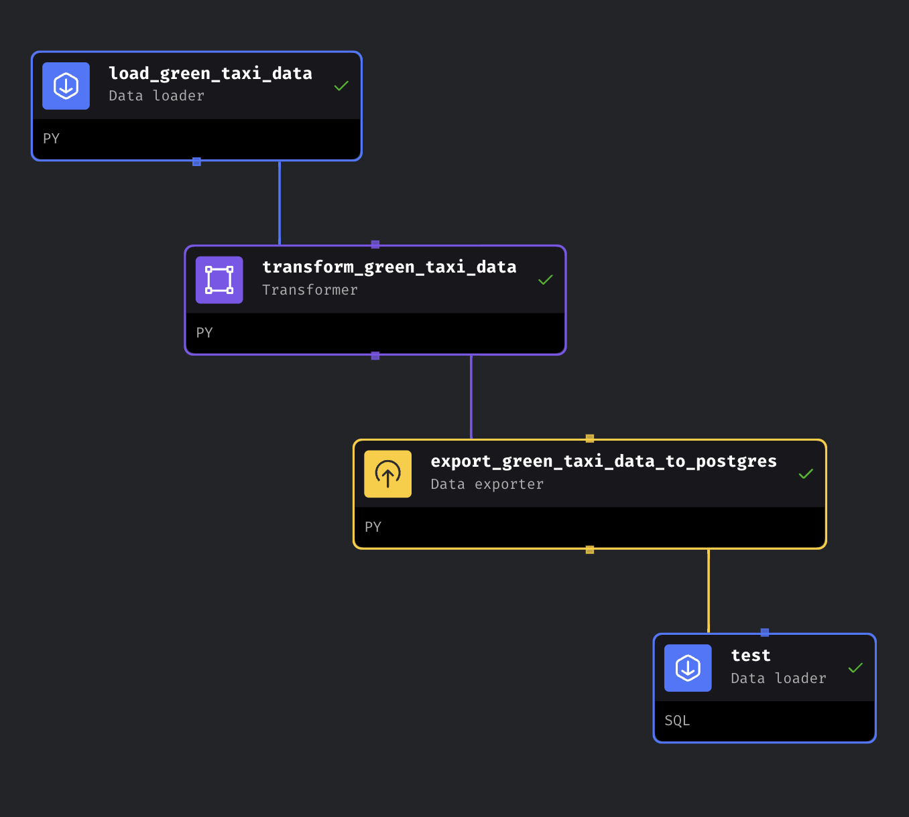

# Mage 

Mage, an open-source 🌐 and hybrid framework, transforms and integrates data seamlessly, marrying the flexibility of notebooks with the structured nature of modular code.

- **Data Extraction and Synchronization:** Mage facilitates the seamless extraction and synchronization of data from various third-party sources, ensuring a smooth flow of information. 🔄

- **Transformative Pipelines:** Users can employ real-time and batch pipelines for data transformation, leveraging the power of Python, SQL, and R to manipulate and refine their datasets. 🚀

- **Efficient Loading:** Mage streamlines the loading process by providing pre-built connectors to effortlessly transfer transformed data into data warehouses or data lakes. 🚚

- **Orchestration and Monitoring:** With the ability to run, monitor, and orchestrate thousands of pipelines, Mage ensures that users can manage complex data operations without losing sleep over potential issues. 🎭

Mage operates on a set of fundamental concepts, each contributing to its functionality:

- **Project (🏢):** Similar to a repository on GitHub, the Project is the space where users can organize and store all their code, fostering collaboration and version control. 🤝

- **Pipeline (🪈):** A central element in Mage, a Pipeline contains references to code blocks, visualization charts, and organizes dependencies between code blocks to create a coherent workflow. 🔄

- **Block (🧱):** These are individual files containing code that can be executed independently or within a Pipeline, promoting modularity and reusability. 🧩

- **Data Product (🤓):** After execution, each Block produces a data product, creating a structured output that can be further utilized in subsequent processes. 📊

- **Trigger (⏰):** A set of instructions that define when or how a Pipeline should run, providing users with control over the timing and conditions of their data workflows. 🕰️

- **Run (🏃):** Stores comprehensive information about the execution of a Pipeline, including start and completion times, status, and runtime variables, offering valuable insights into the execution process. 📅

Together, these features and concepts make Mage a powerful and comprehensive tool for anyone involved in data transformation and integration, combining ease of use with robust functionality. 🛠️


## Defining the pipeline

This pipeline is going to extract the [`yellow_taxi`](https://github.com/DataTalksClub/nyc-tlc-data/releases/tag/yellow) data, and then insert it into a `Postgres` database.

Here I show you the simple data pipeline graph.




## Blocks

### DATA LOADER
```python
import io
import pandas as pd
import requests
if 'data_loader' not in globals():
    from mage_ai.data_preparation.decorators import data_loader
if 'test' not in globals():
    from mage_ai.data_preparation.decorators import test


@data_loader
def load_data_from_api(*args, **kwargs):
    """
    Template for loading data from API
    """
    skeleton_url = 'https://github.com/DataTalksClub/nyc-tlc-data/releases/download/yellow/yellow_tripdata_{}.csv.gz'

    months = ['2019-01']

    data = []
    
    # Its always a good practice to define the data types before loading.
    taxi_dtypes = {
        'VendorID' : pd.Int64Dtype(),
        'passenger_count' : pd.Int64Dtype(),
        'trip_distance' : float,
        'RatecodeID' : pd.Int64Dtype(),
        'store_and_fwd_flag' : str,
        'PULocationID' : pd.Int64Dtype(),
        'DOLocationID' : pd.Int64Dtype(),
        'payment_method' : pd.Int64Dtype(),
        'fare_amount': float,
        'extra' : float,
        'mta_tax' : float,
        'tip_amount' : float,
        'tolls_amount' : float,
        'improvement_surcharge' : float,
        'total_amount' : float,
        'congestion_surcharge' : float
    }

    parse_dates = ['tpep_pickup_datetime', 'tpep_dropoff_datetime']

    for month in months:
        url = skeleton_url.format(month)
        print('loading file: ', url)
        df_iterator = pd.read_csv(url, sep=',', compression='gzip', dtype=taxi_dtypes, parse_dates=parse_dates, iterator=True, chunksize=100000)
        
        data_lst = []
        counter = 1
        
        for df in df_iterator:
            print('reading chunk: ', counter)
            data_lst.append(df)
            counter += 1
            

        data.extend(data_lst)

    return pd.concat(data)


@test
def test_output(output, *args) -> None:
    """
    Template code for testing the output of the block.
    """
    assert output is not None, 'The output is undefined'
```

### TRANSFORMER

```pyhton
import pandas as pd

if 'transformer' not in globals():
    from mage_ai.data_preparation.decorators import transformer
if 'test' not in globals():
    from mage_ai.data_preparation.decorators import test


@transformer
def transform(data, *args, **kwargs):
    
    data_lst = []

    def chunker(seq, size):
        for pos in range(0, len(seq), size):
            yield seq.iloc[pos:pos + size]

    
    df_chunks = chunker(data, 100000)

    counter = 1

    for chunk in df_chunks:

        print('processing chunk:', counter)
        
        chunk = chunk[chunk.trip_distance > 0]

        chunk = chunk[chunk.passenger_count > 0]

        chunk['tpep_pickup_date'] = chunk['tpep_pickup_datetime'].dt.date

        chunk.columns = (chunk.columns
                        .str.replace(r'(?<=[a-z])(?=[A-Z])', '_', regex=True)
                        .str.lower()
        )

        data_lst.append(chunk)

        counter += 1

    return pd.concat(data_lst)


@test
def test_output(output, *args) -> None:
    """
    Template code for testing the output of the block.
    """
    assert output is not None, 'The output is undefined'


@test
def test_output(output, *args) -> None:
    
    assert output['trip_distance'].isin([0]).sum() == 0, 'There are rides with zero passengers'


@test
def test_output(output, *args) -> None:
    
    assert output['passenger_count'].isin([0]).sum() == 0, 'There are rides with zero passengers'


@test
def test_output(output, *args) -> None:
    """
    Template code for testing the output of the block.
    """
    assert 'vendor_id' in output.columns, f'vendor_id is not in {output.columns}'
```

### DATA EXPORTER

```python
from mage_ai.settings.repo import get_repo_path
from mage_ai.io.config import ConfigFileLoader
from mage_ai.io.postgres import Postgres
from pandas import DataFrame
from os import path

if 'data_exporter' not in globals():
    from mage_ai.data_preparation.decorators import data_exporter


@data_exporter
def export_data_to_postgres(df: DataFrame, **kwargs) -> None:
    """
    Template for exporting data to a PostgreSQL database.
    Specify your configuration settings in 'io_config.yaml'.

    Docs: https://docs.mage.ai/design/data-loading#postgresql
    """
    schema_name = 'mage'  # Specify the name of the schema to export data to
    table_name = 'yellow_taxi'  # Specify the name of the table to export data to
    config_path = path.join(get_repo_path(), 'io_config.yaml')
    config_profile = 'dev'

    def chunker(seq, size):
        for pos in range(0, len(seq), size):
            yield seq.iloc[pos:pos + size]

    df_chunks = chunker(df, 100000)

    counter = 1

    with Postgres.with_config(ConfigFileLoader(config_path, config_profile)) as loader:
        for df_chunk in df_chunks:
            print("inserting chunk: ", counter)
            loader.export(
                df_chunk,
                schema_name,
                table_name,
                index=False,  # Specifies whether to include index in exported table
                if_exists='append',  # Specify resolution policy if table name already exists
            )

            counter += 1
```
