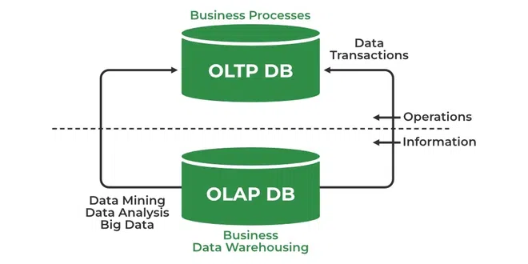
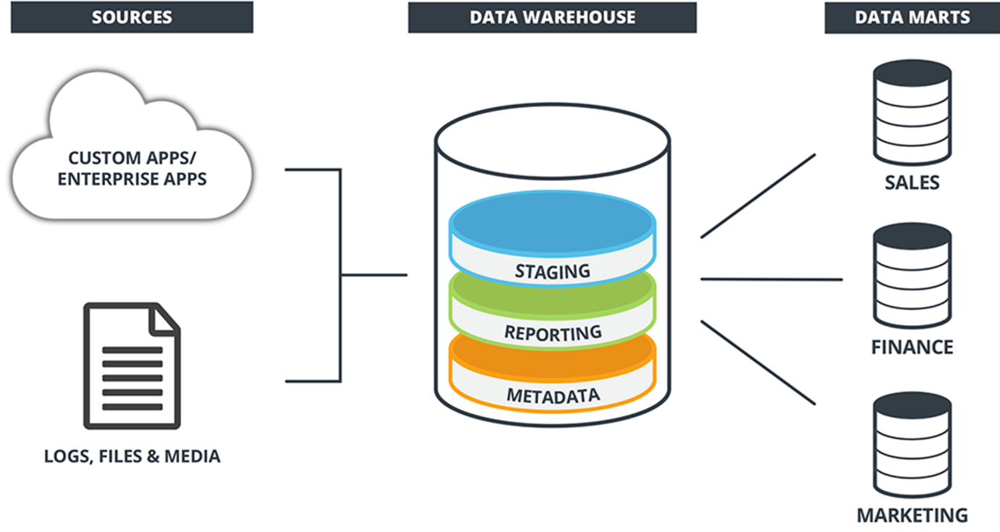
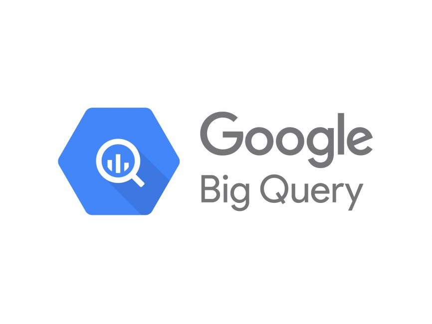
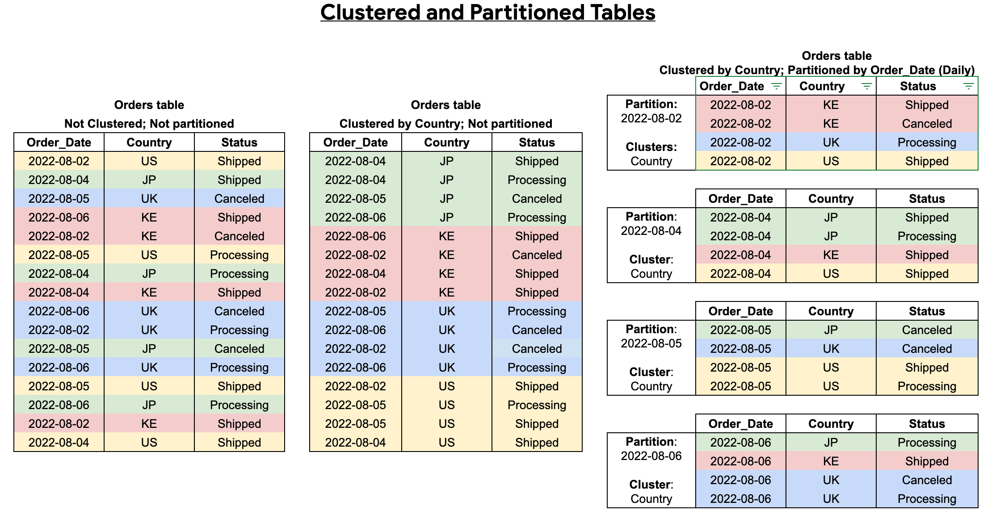

# Data Engineering Zoomcamp 2024 Notes Module 3

## Summary

OLAP and OLTP serve distinct database needs: OLTP ensures swift transaction processing, while OLAP supports complex analytical queries for decision-making. Data warehouses, like BigQuery, consolidate historical data for reporting and analysis. BigQuery, a Google Cloud offering, excels in scalable, cost-effective analysis. Techniques like partitioning and clustering optimize data storage and access efficiency. 🛢️🔍🏢

## What is OLTP and OLAP?

OLAP (Online Analytical Processing) and OLTP (Online Transactional Processing) are two different types of database systems, each optimized for distinct purposes.

1. **OLTP (Online Transactional Processing)**:
   - **Purpose**: OLTP systems are designed for managing transaction-oriented applications, where the emphasis is on processing a large number of short, online transactions (e.g., `INSERT`, `UPDATE`, `DELETE`).
   - **Characteristics**:
     - **High Volume**: Handles a large number of concurrent transactions. 📈
     - **Low Latency**: Prioritizes quick response times for individual transactions. ⏱️
     - **Normalized Schema**: Typically employs a highly normalized database schema to minimize redundancy and maintain data integrity. 🔍
     - **Example**: Online banking systems, e-commerce platforms, airline reservation systems. 💳 🛒 ✈️

2. **OLAP (Online Analytical Processing)**:
   - **Purpose**: OLAP systems are geared towards analytical and decision-support applications, where the focus is on complex queries involving aggregations, calculations, and historical data analysis.
   - **Characteristics**:
     - **Complex Queries**: Supports complex analytical queries involving aggregations, roll-ups, and drill-downs. 📊
     - **Read-Heavy**: Primarily optimized for read operations rather than write operations. 📚
     - **Denormalized Schema**: Often uses a denormalized or star/snowflake schema to optimize query performance. ❄️
     - **Example**: Business intelligence tools, reporting systems, data warehouses. 📈 📊 🏢

|                     | OLTP 💼                                                                                           | OLAP 🔍                                                                           |
| ------------------- | ------------------------------------------------------------------------------------------------- | --------------------------------------------------------------------------------- |
| Purpose             | Control and run essential business operations in real time                                        | Plan, solve problems, support decisions, discover hidden insights                 |
| Data updates        | Short, fast updates initiated by user                                                             | Data periodically refreshed with scheduled, long-running batch jobs               |
| Database design     | Normalized databases for efficiency                                                               | Denormalized databases for analysis                                               |
| Space requirements  | Generally small if historical data is archived                                                    | Generally large due to aggregating large datasets                                 |
| Backup and recovery | Regular backups required to ensure business continuity and meet legal and governance requirements | Lost data can be reloaded from OLTP database as needed in lieu of regular backups |
| Productivity        | Increases productivity of end users                                                               | Increases productivity of business managers, data analysts, and executives        |
| Data view           | Lists day-to-day business transactions                                                            | Multi-dimensional view of enterprise data                                         |
| User examples       | Customer-facing personnel, clerks, online shoppers                                                | Knowledge workers such as data analysts, business analysts, and executives        |

## What is a Data Warehouse? 🏢

A data warehouse is a centralized repository that stores structured, historical data from one or more sources. It's designed to facilitate reporting, analysis, and data mining (OLAP solution).

1. **Purpose**: The primary purpose of a data warehouse is to provide a unified view of an organization's data, enabling decision-makers to analyze trends, patterns, and relationships across different aspects of the business. 📊

2. **Components**: A data warehouse typically includes components such as:
   - ETL (Extract, Transform, Load) processes to extract data from source systems, transform it into a consistent format, and load it into the warehouse.
   - Data marts, which are subsets of the data warehouse focused on specific business functions or departments.
   - OLAP (Online Analytical Processing) cubes for multidimensional analysis.
   - Metadata repositories for storing information about the data warehouse's structure and content. 🔄

3. **Benefits**: Data warehouses offer several benefits, including:
   - Improved decision-making: By providing access to integrated, high-quality data, data warehouses empower users to make more informed decisions.
   - Data consistency: Data warehouses enforce consistent naming conventions, definitions, and formats, ensuring that users can trust the accuracy and reliability of the data.
   - Scalability: Data warehouses are designed to handle large volumes of data and support complex analytical queries, making them suitable for organizations of all sizes. 📈

## BigQuery

**BigQuery** is a fully managed, serverless cloud data warehouse provided by Google Cloud Platform. It's designed for scalable and cost-effective analysis of big data sets in real-time using SQL queries. Here's an overview:

1. **Purpose**: BigQuery is built for analyzing large volumes of data quickly and cost-effectively. It enables users to run SQL queries against datasets ranging from gigabytes to petabytes in size, without the need for infrastructure provisioning or management. 📊💰

2. **Key Features**:
   - **Scalability**: BigQuery automatically scales to handle growing data volumes, allowing users to focus on analysis rather than infrastructure management. 📈
   - **Speed**: It provides high-speed SQL queries against large datasets, with the ability to process terabytes of data in seconds. ⚡
   - **Serverless**: Users can simply upload their data to BigQuery and start querying it immediately, without the need to set up or maintain servers. 🛠️
   - **Integration**: BigQuery integrates seamlessly with other Google Cloud services and third-party tools, making it easy to ingest, process, and visualize data. 🔗
   - **Security**: It offers built-in security features such as encryption at rest and in transit, access controls, and audit logging. 🔒
   - **Cost-effectiveness**: BigQuery offers a pay-as-you-go pricing model, where users only pay for the queries they run and the storage they use, with no upfront costs or long-term commitments. 💸

3. **Use Cases**:
   - **Business Intelligence**: BigQuery is commonly used for business intelligence and analytics, enabling organizations to gain insights from their data and make data-driven decisions. 📈📊
   - **Data Engineering**: It's also used for data engineering tasks such as data transformation, data cleaning, and data preparation. 🛠️
   - **Machine Learning**: BigQuery integrates with Google Cloud's machine learning services, allowing users to build and deploy machine learning models using their data stored in BigQuery. 🤖

4. **Benefits**:
   - **Scalability**: BigQuery scales seamlessly to handle large and complex analytical workloads. 📈
   - **Performance**: It provides fast query performance, enabling users to analyze data in real-time. ⚡
   - **Simplicity**: BigQuery's serverless architecture eliminates the need for infrastructure management, making it easy to use for both technical and non-technical users. 🤹
   - **Cost-effectiveness**: Users only pay for the resources they use, with no upfront costs or long-term commitments, making it a cost-effective solution for big data analytics. 💰

## Partitioning and Clustering

Partitioning and clustering are techniques used to improve the performance and efficiency of data storage and query processing in databases, including BigQuery. 🛠️

**Partitioning**:
Partitioning involves dividing a large table into smaller, more manageable chunks called partitions based on a specified column or criterion. Each partition typically contains a subset of the data, making it easier to manage and query large datasets. Here are some key points about partitioning:

- **Purpose**: Partitioning helps improve query performance by allowing the database to access only the relevant partitions when executing queries, rather than scanning the entire table. 🚀
- **Criteria**: Tables can be partitioned based on various criteria such as range (e.g., by date or timestamp), list (e.g., by category or region), or hash (e.g., by a hash of the partitioning column). 📊
- **Benefits**: Partitioning can lead to faster query execution times, reduced storage costs, and improved data management and maintenance. 💰
- **Example**: In BigQuery, partitioned tables are divided into segments based on the partitioning column, enabling more efficient querying and storage management for large datasets. 🗄️

**Clustering**:
Clustering is a technique used in conjunction with partitioning to further organize data within each partition. It involves physically sorting and storing the data in each partition based on one or more clustering columns. Here are some key points about clustering:

- **Purpose**: Clustering helps improve query performance by arranging related data together within each partition, reducing the amount of data that needs to be scanned during query execution. 🔍
- **Criteria**: Clustering columns are chosen based on the typical access patterns and query requirements. Queries that filter, join, or group by the clustering columns benefit from improved performance. 🎯
- **Benefits**: Clustering can lead to further reduction in query execution times, as well as improved data compression and storage efficiency. 💡
- **Example**: In BigQuery, clustering is achieved by specifying clustering columns when creating or altering a table. The data within each partition is then sorted and stored based on the values of the clustering columns. 🏷️

The following image shows how Partitioning and Clustering works.

